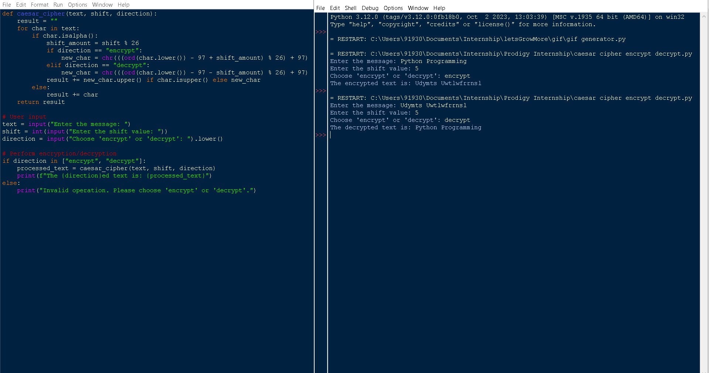

## ABOUT

A Python implementation of the Caesar Cipher, providing both encryption and decryption functionalities. This project includes a user-friendly command-line interface for easy interaction.

# Caesar Cipher in Python

This repository contains a Python script that implements the classic Caesar Cipher. It's a type of substitution cipher in which each letter in the plaintext is shifted a certain number of places down or up the alphabet.

## Screenshot

Include screenshots of your application in action here. For example:



## Features

- **Encryption**: Shifts the letters of the input text by a specified number to encrypt the message.
- **Decryption**: Reverses the encryption process to retrieve the original text from the encrypted message.
- **Command-Line Interface**: Easy to use command-line prompts for inputting text, shift value, and choosing the operation.

## How to Use

1. Clone the repository to your local machine.
2. Run the script using Python 3.x.
3. Follow the on-screen prompts:
   - Enter the message you want to encrypt or decrypt.
   - Enter the shift value (number of positions letters should be shifted).
   - Choose the operation ('encrypt' or 'decrypt').

## Example

```python
Enter the message: Hello World!
Enter the shift value: 3
Choose 'encrypt' or 'decrypt': encrypt
The encrypted text is: Khoor Zruog!


